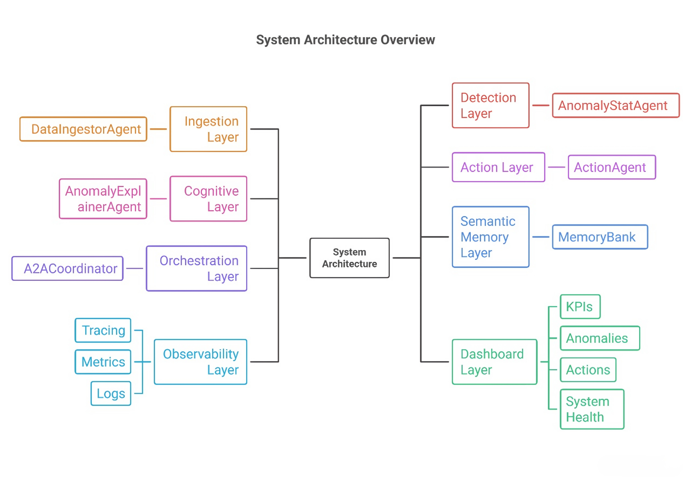
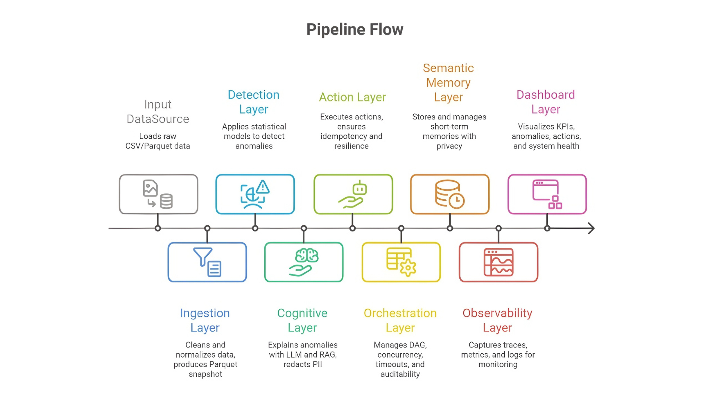

# 🧠 SalesOps Suite
[]()
[](LICENSE)
[]()
</br>
**Last Updated:** November 30, 2025


### Autonomous Multi-Agent System for Sales Anomaly Detection, Explanation & Action


### 🎥 Demo

Click below GIF to watch the full system walkthrough video on YouTube 👇

<a href="https://youtu.be/ZRhFIN6M-SU?si=7JeK_1ey9rsHUyO4" target="_blank">
  
</a>
<br/>
or

**[▶ Click here to Watch the Full Demo on Google Drive](https://drive.google.com/file/d/1oLFiwM69JneML1y1TflJP2gkbON41Kj3/view?usp=drive_link)**
---

## 🚀 Overview

The **SalesOps Suite** is a production-grade, autonomous multi-agent system designed to monitor enterprise sales data, detect hidden anomalies, explain root causes using Generative AI, and execute remediation actions without human intervention.

Built on the **Google Agent Development Kit (ADK)** and powered by **Gemini 2.5 Flash**, this system acts as a 24/7 Sales Analyst that:

✔️ **Monitors** raw transaction data for quality and consistency.  
✔️ **Detects** statistical outliers (Z-Score/IQR) with 100% recall on synthetic test sets.  
✔️ **Explains** "Why" issues happened using RAG (Retrieval Augmented Generation) and semantic memory.  
✔️ **Acts** by triggering downstream workflows (Jira Tickets, Email Alerts) via a Mock Enterprise API.  
✔️ **Remembers** past resolutions to solve recurring problems faster.  
✔️ **Observes** its own performance with deep tracing, metrics, and audit logs.

---

## 🎯 The Problem & Solution

### The Challenge
Sales Operations teams are overwhelmed by data. With thousands of daily transactions, critical issues-like a sudden revenue dip in a specific region or a pricing error-often go unnoticed for weeks. Manual investigation is slow, siloed, and reactive.

### The Solution: "Vertical AI"
Instead of disjointed dashboards, we built a **Vertical AI Agent** that owns the entire lifecycle of a problem:

1.  **Detection:** Mathematical certainty finding the "needle in the haystack."
2.  **Cognition:** LLM-based reasoning to contextualize the math.
3.  **Execution:** API-based action to close the loop.

---

# 🏗️ System Architecture


<br/>
The system implements a **Sequential Orchestration Pattern** with **Parallel Fan-Out** for high-throughput AI processing.

### **1. Ingestion Layer**
* **Agent:** `DataIngestorAgent`
* **Role:** Loads raw CSV/Parquet data, handles encoding (UTF-8/Latin1) fallbacks, normalizes schemas, and produces a clean Parquet snapshot.

### **2. Detection Layer**
* **Agent:** `AnomalyStatAgent`
* **Role:** Applies robust statistical models:
    * **Global Z-Score:** Detects massive system-wide spikes/dips.
    * **Grouped IQR:** Detects subtle outliers within specific Regions or Categories.
    * **Dynamic Sensitivity:** Auto-adjusts thresholds to catch "deep dips" (e.g., 99% revenue drops).

### **3. Cognitive Layer (LLM + RAG)**
* **Agent:** `AnomalyExplainerAgent`
* **Role:** Consumes the mathematical anomalies and enriches them with "Human Meaning."
    * **RAG:** Queries the `MemoryBank` for similar past incidents.
    * **Gemini 2.5:** Generates a structured Business Analysis (JSON).
    * **Safety:** Redacts PII (Email/Phone) before sending data to the LLM.

### **4. Action Layer**
* **Agent:** `ActionAgent`
* **Role:** The "Hands" of the system.
    * **Idempotency:** Hashes every request to prevent duplicate tickets.
    * **Resilience:** Implements Exponential Backoff and Jitter for API retries.
    * **Firewall:** Validates payloads against an OpenAPI schema before execution.

### **5. Orchestration Layer**
* **Agent:** `A2ACoordinator`
* **Role:** The "Manager."
    * Manages the DAG (Directed Acyclic Graph) of tasks.
    * Handles concurrency (Thread Pools) for parallel explanation.
    * Enforces Timeouts and Cancellations.
    * Writes atomic "Run Manifests" for auditability.

### **6. Semantic Memory Layer**
* **Module:** `memory/`
* **Role:** A lightweight Vector Store (using TF-IDF/Cosine Similarity).
    * **TTL:** Auto-expires short-term memories.
    * **Capacity:** Enforces LRU eviction to manage storage costs.
    * **Privacy:** Regex-based PII scrubbing on ingress.

### **7. Observability Layer**
* **Module:** `observability/`
* **Role:** The "Flight Recorder."
    * **Tracing:** Captures Gantt-chart style spans (`@timeit_span`).
    * **Metrics:** Tracks Latency distributions and Token usage.
    * **Logs:** Structured JSONL logs for every component.

### **8. Dashboard Layer**
* **App:** `dashboard/app.py` (Streamlit)
* **Role:** The Command Center. A 7-page UI to visualize KPIs, Anomalies, Actions, and System Health.
---
## 🛣️ Pipeline Flow


<br/>
---

# 📁 Folder Structure

```text
salesops-suite/
├── agents/                    # The Autonomous Workers
│   ├── a2a_coordinator.py     # Master Orchestrator (DAG Manager)
│   ├── action_agent.py        # API Operator (Jira/Email)
│   ├── anomaly_llm_agent.py   # Gemini Wrapper (RAG + Reasoning)
│   ├── anomaly_stats_agent.py # Statistical Math Engine
│   ├── data_ingestor.py       # ETL Worker
│   ├── feature_transforms.py  # Time-series Logic
│   ├── kpi_agent.py           # High-level Metric Calc
│   └── memory_agent.py        # Bridge to Vector Store
│
├── dashboard/              # Streamlit UI
│   ├── app.py              # Main Entry Point
│   ├── pages/              # 7 Individual Dashboard Pages
│   ├── utils/              # Shared UI Components (Charts, Loaders)
│   └── assets/             # Images for README/UI
│
├── dashboard_data/         # Staging Area for UI Data (Generated)
│   ├── actions.jsonl
│   ├── anomalies.json
│   ├── enriched.json
│   └── snapshot.parquet
│
├── data/                   # Data Storage
│   ├── raw/                # Original Input (GitIgnored contents)
│   ├── processed/          # Clean Snapshots
│   └── test_labels/        # Synthetic Golden Data for Eval
│
├── evaluation/                       # QA & Scoring Suite
│   ├── create_synthetic_anomalies.py # Injects fake spikes/dips
│   ├── eval_detector.py              # Calculates Recall/Precision
│   ├── eval_schema_compliance.py     # Validates LLM JSON output
│   ├── impact_simulator.py           # ROI Calculator
│   └── run_all.py                    # Master Eval Script
│
├── memory/                 # Semantic Vector Store
│   ├── memory_bank.py      # Controller (TTL, PII, Persistence)
│   ├── embedder_local.py   # TF-IDF Vectorizer
│   └── backends/           # Storage Engines (InMemory)
│
├── observability/          # Telemetry System
│   ├── logger.py           # Structured JSON Logger
│   ├── collector.py        # Log Aggregator
│   ├── metrics.py          # Prometheus Counters
│   └── tracer.py           # Span Context Manager
│
├── notebooks/                     # Demo & Dev Notebooks
│   ├── 01_data_exploration.ipynb
│   ├── ... (Stages 02-10)
│   ├── 11_integration_demo.ipynb  # The "Mega Demo"
│   └── 12_pipeline_showcase.ipynb # Video Presentation Layer
│
├── openapi/                # API Contracts
│   └── mock_api.yaml       # Swagger Spec for Mock Server
│
├── protocols/              # Internal Protocols
│   └── a2a_protocol.md     # Message Envelope Spec
│
├── scripts/                # Production Drivers
│   └── run_pipeline.py     # CLI wrapper for the full flow
│
├── tests/                  # Pytest Suite
├── tools/                  # External Simulators
│   └── mock_server.py      # FastAPI Server (Port 7777)
│
├── main.py                 # Root CLI Entry Point
├── environment.yml         # Conda Config
├── LICENSE
└── README.md
````

---

# 🔧 Installation & Setup

### **1. Clone the Repository**

```bash
git clone [https://github.com/Yash-Kakadiya/salesops-suite.git](https://github.com/Yash-Kakadiya/salesops-suite.git)
cd salesops-suite
```

### **2. Configure Environment**

We use a strict Conda environment to ensure reproducibility.

```bash
# Create environment from file
conda env update --file environment.yml --prune

# Activate environment
conda activate salesops
```
> 💡 **Tip:** If `conda env update` is slow, you can use **mamba** for faster dependency solving:
>
> ```bash
> mamba env create -f environment.yml
> ```


### **3. Configure Credentials**

Create a `.env` file in the root directory.

  * **GOOGLE\_API\_KEY:** Required for Gemini.
  * **MOCK\_API\_URL:** Defaults to the included local server.

<!-- end list -->

```env
GOOGLE_API_KEY=your_actual_api_key_here
MOCK_API_URL=http://localhost:7777
OBSERVABILITY_DIR=outputs/observability
```

### **4. Verify Setup**

Run this quick check to ensure all libraries are loaded:

```bash
python - <<'PY'
missing=[]
for pkg in ("fastapi","streamlit","google.genai"):
    try:
        __import__(pkg.split('.')[0])
    except Exception as e:
        missing.append(f"{pkg}: {e}")
if missing:
    print("⚠️ Missing or broken dependencies:", missing)
else:
    print("✅ Dependencies OK")
PY

```

---

# ▶️ Usage Guide

You can run the system in three modes depending on your role.

### **Mode A: The "Production" Run (CLI)**

*Best for: Automated Cron Jobs / Backend Testing*

This command runs the entire pipeline: Ingest → Detect → Explain → Act.
It handles the Mock Server lifecycle automatically.

```bash
python main.py --data data/raw/superstore.csv --workers 3
```

  * **Output:** Generates logs and artifacts in `outputs/runs/`.

---

### **Mode B: The "Command Center" (Dashboard)**

*Best for: Human Review & Presentation*

This launches the Streamlit UI where you can see the anomalies, read the AI analysis, and audit the actions.

```bash
streamlit run dashboard/app.py
```

  * **Access:** Open your browser at `http://localhost:8501`.
  * **Note:** The mock API server (ActionAgent target) runs by default on port `7777`.
---

### **Mode C: The "QA Check" (Evaluation)**

*Best for: verifying Technical Quality*

This runs the full test suite, including generating synthetic data and scoring the detector.

```bash
python evaluation/run_all.py
```

  * **Output:** `evaluation_summary.json` with F1 Scores and ROI estimates.

---
---

### **Mode D: One-Command End-to-End Demo**

This command:

1. Runs the full pipeline (Ingest → Detect → Explain → Act)  
2. Prepares dashboard data
3. Runs the evaluation suite
4. Opens the Streamlit UI  

```bash
python scripts/run_pipeline.py --data data/raw/superstore.csv
```
```bash
python evaluation/run_all.py
```
```bash
streamlit run dashboard/app.py
```
---
### Example output (where to look)

After a run the following artifacts are produced (example locations):
- `outputs/runs/<run_id>/manifest.jsonl` - run manifest and status
- `dashboard_data/enriched.json` - enriched anomalies for the UI
- `outputs/observability/llm_calls.jsonl` - raw LLM responses (audit)
- `dashboard_data/snapshot.parquet` - cleaned snapshot used by the pipeline

---
### Example Manifest (Truncated)

```json
{
  "run_id": "run_20251117T201234Z_ab12ef",
  "status": "completed",
  "start_ts": "2025-11-17T20:12:34Z",
  "end_ts": "2025-11-17T20:12:40Z",
  "artifacts": {
    "snapshot": "outputs/runs/<run_id>/snapshot.parquet",
    "explanations": "outputs/runs/<run_id>/enriched_anomalies.json"
  }
}
```
---

# 🧪 Testing & Quality Assurance

This project emphasizes **Enterprise Reliability**. We don't just "hope" it works; we test it.

### **Unit & Integration Tests**

Run the full `pytest` suite to verify:

  * **Idempotency:** Re-running an action does not create duplicate tickets.
  * **Circuit Breakers:** The system halts elegantly if the LLM API fails repeatedly.
  * **PII Safety:** Sensitive data is redacted before storage.

<!-- end list -->

```bash
pytest -q
```

### **Evaluation Metrics**

The `evaluation/` module provides a rigorous "Report Card":

  * **Detector Recall:** *Reported 1.0 (100%)* **on the synthetic spike test set** included in `data/test_labels/` (synthetic anomalies injected deterministically). Real-world recall may vary - see Evaluation section for details.
  * **Schema Compliance:** **100%** on the automated schema tests used in the evaluation suite (these tests validate the output format and basic constraints; they do not guarantee semantic correctness).
  * **Resilience:** Survives **50% Chaos Failure Rate** (simulated network errors).

---

# 📦 Production Components

### **Mock Enterprise Server**

Included in `tools/mock_server.py`.

  * **Tech Stack:** FastAPI + Uvicorn.
  * **Port:** 7777.
  * **Features:**
      * Simulates Jira (`POST /tickets`) and Email (`POST /emails`).
      * **Chaos Mode:** Can be toggled to randomly return 500 errors to test Agent resilience.
      * **Persistence:** Saves state to `mock_db.json`.

---
## Troubleshooting

**Common issues**

- `conda env` creation fails: try `mamba env create -f environment.yml` (install `mamba` in base env first).  
- `conda activate` not recognized: run `conda init powershell` (Windows PowerShell) or restart your shell.  
- Streamlit doesn't open on 8501: check if another service uses that port, or run `streamlit run dashboard/app.py --server.port 8502`.  
- Mock server port mismatch: mock server runs on **7777**; the dashboard runs on **8501** by default. Ensure `.env` uses `MOCK_API_URL=http://localhost:7777`.  
- LLM calls failing: ensure `GOOGLE_API_KEY` is set in `.env` and that network access to Google AI Studio is allowed.
---

# 🙌 Acknowledgements

  * **Kaggle & Google:** For the "AI Agents" Intensive Course.
  * **Superstore Dataset:** Standard retail dataset used for benchmarking.
  * **Gemini 2.5 Flash:** The reasoning engine powering the insights.

---
## 👨‍💻 Author

**Yash Kakadiya** 
<br/>
💼 Computer Science Student | AI & Business Innovation Enthusiast
<br/>
📍 Rajkot, Gujarat, India 
<br/>
🔗 [GitHub Profile](https://github.com/Yash-Kakadiya)

---

# 📜 License

This project is licensed under the **MIT License**.
See the `LICENSE` file for details.

---
